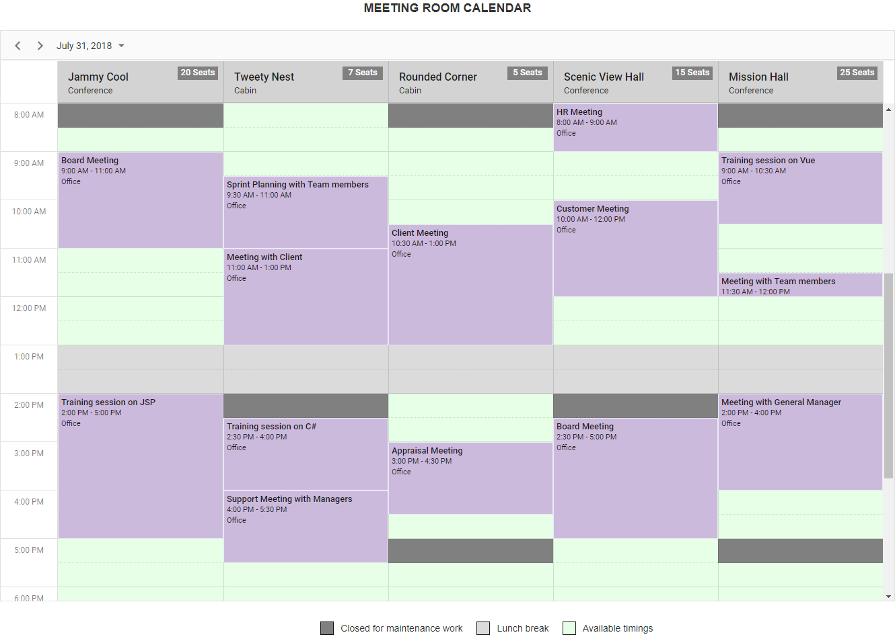

# Meeting room calendar

A meeting room calendar displays a list of conference rooms in a corporate office with quick overview to the available rooms. Other than the reserved time slots for meeting purpose, the common unavailability such as lunch break and maintenance timings of those meeting rooms will be blocked and is unaccessible by anyone. This application has been built completely by making use of the [quick start](https://github.com/syncfusion/ej2-quickstart.git) TypeScript project.



It has been designed by making use of the [multiple resources](https://ej2.syncfusion.com/documentation/schedule/resources.html?lang=typescript) feature of scheduler component.

## How to run this application?

To run this application, you need to first clone the `ej2-schedule-meeting-room-calendar` repository and then navigate to its appropriate path where it has been located in your system.

To do so, open the command prompt and run the below commands one after the other.

```
git clone https://github.com/SyncfusionSamples/ej2-schedule-meeting-room-calendar meeting-room
cd meeting-room
```

## Installing

Once done with downloading, next you need to install the necessay packages required to run this application locally. The `npm install` command will install all the needed JS2 packages into your current project and to do so, run the below command.

```
npm install
```

## Running

Finally, you can now use the below `npm` script to run the web application.

```
npm start
```

As this application is configured with `browser-sync`, therefore it will serve the web application directly in your default browser.


