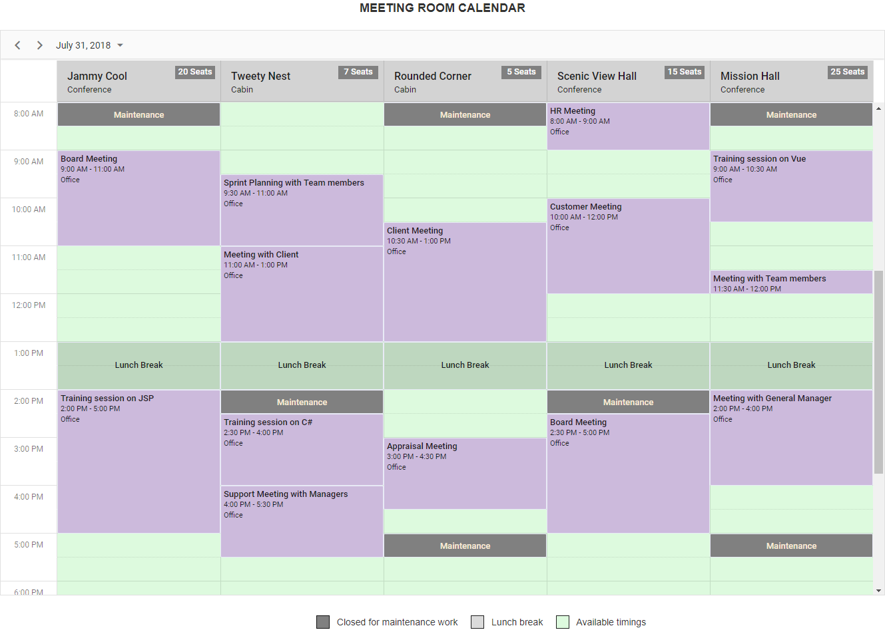

# Meeting room calendar

A meeting room calendar displays a list of conference rooms in a corporate office with quick overview to the available rooms. Other than the reserved time slots for meeting purpose, the common unavailable timings such as lunch break and maintenance works of those meeting rooms will be blocked and unaccessible to anyone. This application has been built completely by making use of the [quick start](https://github.com/syncfusion/ej2-quickstart.git) TypeScript project.



It has been developed by making use of the [multiple resources](https://ej2.syncfusion.com/documentation/schedule/resources.html?lang=typescript) feature of scheduler component.

## Calendar functionalities

The multiple resources functionalities incorporated in this sample application are,

* **[resources](https://ej2.syncfusion.com/documentation/schedule/resources.html?lang=typescript)** - Defines the resource data. Here, the meeting room data is provided as dataSource.
* **[group](https://ej2.syncfusion.com/demos/#/material/schedule/group.html)** - Allows the scheduler layout to group the resources physically. Here, 5 rooms are displayed visually on the same scheduler.
* **[byDate]**(https://ej2.syncfusion.com/demos/#/material/schedule/group-bydate.html) - Allows grouping of all the meeting rooms date-wise.
* **[resourceHeaderTemplate](https://ej2.syncfusion.com/demos/#/material/schedule/group-custom-work-days.html)** - Allows customization of resource header cells. Here, the header row is customized by displaying the room names accompanied with its capacity and type.
* **[allowGroupEdit](https://ej2.syncfusion.com/demos/#/material/schedule/group-editing.html)** - Allows the same appointment to be shared by more than one resource. Here, the `lunch break` and `maintenance` appointments are the grouped one and are made read-only.
* **[Client-side events](https://ej2.syncfusion.com/demos/#/material/schedule/events.html)** - Events such as `actionBegin`, `renderCell`, `popupOpen` and `eventRendered` has been used in this application for achieving major customization of scheduler as well as in achieving the room reservation functionality. 

## How to run this application?

To run this application, you need to first clone the `ej2-schedule-meeting-room-calendar` repository and then navigate to its appropriate path where it has been located in your system.

To do so, open the command prompt and run the below commands one after the other.

```
git clone https://github.com/SyncfusionSamples/ej2-schedule-meeting-room-calendar meeting-room
cd meeting-room
```

## Installing

Once done with downloading, next you need to install the necessay packages required to run this application locally. The `npm install` command will install all the needed JS2 packages into your current project and to do so, run the below command.

```
npm install
```

## Running

Finally, you can now use the below `npm` script to run the web application.

```
npm start
```

As this application is configured with `browser-sync`, therefore it will serve the web application directly in your default browser.


